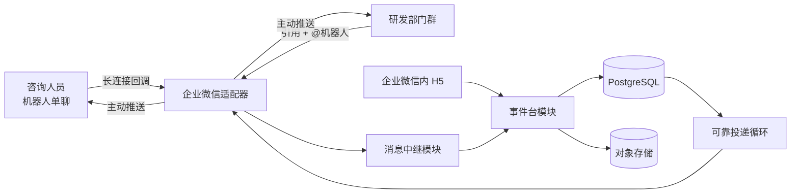

# 企业微信客户问题流转机器人：MVP 实施方案

本文把[实施基线](./IMPLEMENTATION_BASELINE.md)转化为可执行的 MVP 方案。若本文与实施基线冲突，以实施基线中较新的明确决定为准。

## 1. MVP 要证明什么

MVP 只证明一条完整链路：

1. 咨询人员在机器人单聊中提交文本或“文字 + 截图”的图文混排客户问题。
2. 咨询显式创建事件并从企业通讯录身份中选择研发人员。
3. 机器人把问题发送到该研发人员所属团队的群，并明确提醒当前处理人。
4. 研发引用携带事件标记的消息、`@机器人` 后正式回复。
5. 机器人把研发反馈发送给当前咨询经办人；咨询队列已绑定咨询群时，也向该群发送完整副本。
6. 咨询经办人直接交接给另一位咨询人员后，新经办人可以看到同一事件的完整时间线并继续沟通。
7. 咨询确认客户侧闭环后关闭事件。

MVP 不包含：

- 独立图片、文件、语音和视频消息；第一版支持 `text` 和由文字、图片有序组成的 `mixed`。
- 自动同步企业微信通讯录和组织架构；第一版人工配置团队与成员。
- 重复事件合并、自动拆分、SLA、统计报表和智能摘要。
- 会话内容存档；研发群中未 `@机器人` 的内部讨论仍不进入事件历史。
- 复杂的数据保留和删除策略。
- 原地持续更新一张模板卡片。

这些能力可以在后续迭代加入，但第一版数据结构不能阻碍它们。

## 2. 推荐技术形态

- 后端：Python 3.12、FastAPI、SQLAlchemy 2、Alembic。
- 数据库：PostgreSQL。测试使用隔离测试库，不让数据库细节进入业务接口。
- 图片存储：S3 兼容对象存储；本地使用 MinIO，试点环境复用企业已有对象存储。
- H5：FastAPI 服务端页面加少量渐进增强 JavaScript；MVP 不拆独立前端工程。
- 企业微信接入：智能机器人长连接模式。
- 运行形态：一个代码库、两个进程。
  - `web`：H5、企业微信 OAuth 和表单请求。
  - `bot-worker`：长连接收发和待投递消息处理。
- 本地环境：Docker Compose 启动 PostgreSQL、MinIO、`web` 和 `bot-worker`。

选择这个形态的原因是：MVP 需要真实的长连接、OAuth、事务和重试，但不需要微服务、消息队列或独立 SPA。

## 3. 系统形状



H5 和机器人不是两套业务系统。它们是同一个“事件台模块”的两个入口，共享相同规则、权限和事务。

## 4. 核心交互

### 4.1 首次部署与会话初始化

1. 企业超级管理员创建智能机器人，避免回调中只能获得无法与通讯录对应的加密用户标识。
2. 管理员在事件中心录入：
   - 咨询队列；
   - 研发责任团队；
   - 人员与内部团队的映射；
   - 团队管理员。
3. 每个研发群和可选咨询群分别由对应团队管理员执行 `@机器人 绑定研发团队` 或 `@机器人 绑定咨询队列`。机器人从回调取得 `chatid` 并绑定到内部团队。
4. 每位需要接收主动消息的咨询人员先与机器人发生一次单聊交互。
5. 启用前的检查页列出尚未初始化的用户或研发群；咨询群绑定为可选项，未绑定时仍向经办人私聊。

### 4.2 咨询创建事件

1. 咨询在机器人单聊中发送文本或图文混排问题。
2. 该消息没有事件引用标记，因此机器人不会猜测归属，而是保存为短期“消息草稿”。图文混排会按 `msg_item` 顺序规范化为文字片段和图片片段；图片必须在企业微信临时地址失效前下载、解密并转存。
3. 机器人回复两个明确入口：
   - “创建新事件”；
   - “添加到已有事件”。
4. 选择“创建新事件”后打开 H5，原消息已预填；咨询使用可搜索人员选择器选择研发身份。
5. 提交时，后台在一个数据库事务内：
   - 创建事件和机器用事件引用标记；
   - 写入首条时间线记录及其有序内容片段；
   - 根据研发人员找到当前研发团队和群；
   - 创建待投递记录。
6. 投递成功后，事件变为 `open + waiting_on=dev`。

### 4.3 研发正式回复

企业微信主动推送不提供与入站相同的 `mixed` 类型，因此机器人把一条图文正式消息作为一个“投递束”发送。它按原始片段顺序把文字转成 Markdown、把图片转成图片消息；第一个文字片段同时承担事件锚点。如果消息以图片开头，则先插入一个只含事件标题、作者和图片数量的短锚点。每个文字片段末尾都带弱化展示的机器标记，例如：

```text
〔KF·8H2M7QK〕
```

该标记不是秘密，也不要求人员理解或输入。

研发可以引用投递束中的任一文字片段，但不能只引用图片。

1. 研发引用投递束中的文字片段并 `@机器人`，可以发送纯文本或新的图文混排回复。
2. 机器人从 `quote` 内容中解析唯一事件标记，不尝试追溯消息 ID 链。
3. 机器人校验：
   - 当前回调群是否是事件当前研发团队绑定的群；
   - 发送人是否是当前责任研发团队成员；
   - 引用中是否只有一个有效事件标记。
4. 收到图文混排时，机器人立即转存图片并保持文字、图片的原始顺序。
5. 普通回复默认表示“回复并交给咨询”；以明确的“仅同步”动作发送时，不改变当前等待方。
6. 正式回复先写入时间线，再分别为经办人私聊和已绑定的咨询群创建持久化投递。完整私聊投递成功后才把 `waiting_on` 改为 `consult`；群副本独立重试，不阻塞状态切换。
7. 成功时机器人在研发群保持静默；只有引用无效或最终投递失败时才提示。

### 4.4 咨询继续沟通、交接和关闭

- 咨询引用机器人私聊中的事件消息继续补充，默认把 `waiting_on` 切回研发。
- 在 H5 中选择“仅同步”时，消息送达研发但不改变当前等待方。
- 当前经办人或咨询管理员可以直接更换咨询经办人，不要求新经办人确认。
- 交接后机器人向新经办人私聊推送交接快照和详情入口，不重放全部聊天消息。
- 研发正式交付结果后事件仍为打开状态；咨询确认客户侧闭环后才能关闭。

## 5. 领域状态和硬约束

### 5.1 状态字段

| 字段 | 值 | 含义 |
|---|---|---|
| `lifecycle_status` | `open` / `closed` | 事件是否结束 |
| `waiting_on` | `consult` / `dev` / `none` | 当前下一步由哪一侧采取动作 |
| `delivery_status` | `pending` / `sent` / `failed` | 某条跨端消息的投递状态 |

### 5.2 状态变化

| 动作 | 生命周期 | 当前等待方 |
|---|---|---|
| 新事件首次投递成功 | `open` | `dev` |
| 咨询补充并交给研发 | 不变 | `dev` |
| 研发回复并交给咨询 | 不变 | `consult` |
| 任一侧仅同步进展 | 不变 | 不变 |
| 咨询关闭事件 | `closed` | `none` |
| 咨询重新打开 | `open` | 由咨询明确选择 |
| 更换任一经办人或责任团队 | 不变 | 不变 |

### 5.3 必须集中执行的约束

- 一个事件对应一件可独立负责和关闭的问题。
- 所有新建和跟进都必须显式表达，不存在“最近事件”隐式上下文。
- 无法唯一解析事件引用标记时，不得转发。
- 事件属于咨询队列和研发责任团队，个人只是当前处理人。
- 群聊迁移只改变团队沟通通道，不改变事件责任团队。
- 人员调岗不会自动迁移事件责任。
- 研发完成不会自动关闭事件。
- 错绑纠正只能追加记录，不能静默覆盖历史。

## 6. 数据模型

### 6.1 MVP 表

| 表 | 关键字段 | 用途 |
|---|---|---|
| `cases` | `id`, `case_ref`, `title`, `lifecycle_status`, `waiting_on`, `consult_queue_id`, `current_consultant_id`, `current_dev_team_id`, `current_developer_id`, `version`, timestamps | 事件当前状态 |
| `case_entries` | `id`, `case_id`, `sequence`, `kind`, `side`, `actor_user_id`, `actor_name_snapshot`, `message_intent`, `source_msgid`, `corrects_entry_id`, timestamp | 追加式事件时间线头部 |
| `case_entry_parts` | `id`, `entry_id`, `position`, `kind`, `text`, `media_id` | 按原顺序保存一条正式消息中的文字和图片片段 |
| `stored_media` | `id`, `object_key`, `mime_type`, `byte_size`, `sha256`, timestamp | 已下载、解密并转存的图片对象 |
| `users` | `id`, `wecom_userid`, `display_name`, `active` | 企业微信身份映射 |
| `teams` | `id`, `kind`, `name`, `active` | 内部稳定的咨询队列和研发团队 |
| `team_memberships` | `team_id`, `user_id`, `role`, validity timestamps | 可见范围和管理权限 |
| `wecom_channels` | `team_id`, `chatid`, `active`, `initialized_at` | 研发团队或咨询队列的当前群聊通道 |
| `message_drafts` | `id`, `owner_user_id`, `source_msgid`, `expires_at`, `consumed_at` | 把单聊原消息及其内容片段带入显式新建流程 |
| `deliveries` | `id`, `entry_id`, destination, bundle status, attempts, `next_attempt_at`, error, timestamps | 一条正式消息的投递束状态 |
| `delivery_items` | `id`, `delivery_id`, `position`, `kind`, `req_id`, `status`, platform result | 各 Markdown 与图片片段的逐项投递及去重 |

### 6.2 标识规则

- `cases.id` 使用 UUID，永不暴露为交互主标识。
- `case_ref` 使用不易混淆的 Crockford Base32 随机短码，数据库唯一冲突时重新生成。
- 展示格式固定为 `〔KF·XXXXXXX〕`，解析时大小写不敏感。
- `case_ref` 只用于关联，不用于授权。
- 时间线使用事件内单调递增的 `sequence`，页面按它排序，不依赖客户端时间。
- 历史作者同时保存内部用户 ID 和当时的显示名快照，人员改名不会改写旧消息作者。

## 7. 模块与接口

### 7.1 事件台模块 `CaseDesk`

这是核心深模块。H5 和消息中继都只能通过它改变事件，不能直接修改表。

外部接口保持为三个入口：

```text
execute(command, actor) -> CommandResult
get_case(case_ref, viewer) -> CaseView
list_cases(filter, viewer) -> Page[CaseSummary]
```

`command` 是封闭的命令集合，包括创建、追加正式消息、交接咨询、转交研发、迁移研发团队、关闭、重开和纠错。模块内部负责权限、不变量、时间线、状态变化和待投递记录。

### 7.2 企业微信传输 seam `WeComTransport`

企业微信是真实外部依赖，只暴露两个能力：

```text
events() -> async stream[InboundEvent]
send(message) -> DeliveryReceipt
```

提供两个 adapter：

- `LongConnectionWeComAdapter`：真实长连接实现。
- `FakeWeComAdapter`：测试中注入回调、记录主动推送，不连接企业微信。

加密报文、长连接重连、平台字段、Markdown/卡片格式和 `req_id` 都封装在 adapter 内，不泄漏到事件规则。

### 7.3 消息中继模块 `Relay`

```text
handle(inbound_event) -> RelayDecision
deliver_pending(limit) -> DeliveryBatchResult
```

它负责：

- 按 `msgid` 幂等接收；
- 识别单聊草稿、群聊正式回复和管理指令；
- 把 `text` 和 `mixed.msg_item` 规范化成相同的有序内容片段；
- 在媒体临时地址失效前下载、解密并转存图片；
- 从引用内容解析事件标记；
- 把合法输入转换为 `CaseDesk` 命令；
- 从待投递表取任务并调用 `WeComTransport`。

它不自行实现事件状态规则。

### 7.4 组织路由模块 `RoutingDirectory`

```text
resolve_user(wecom_userid) -> User
route_developer(developer_id) -> TeamChannel
authorize(viewer, action, case) -> Decision
```

MVP 的 adapter 从本地数据库读取人工配置。后续若接入企业微信通讯录同步，替换或扩展内部 adapter，不改变事件台接口。

## 8. 企业微信接入细节

### 8.1 接收

- 采用长连接，不以 URL 回调的临时 `response_url` 作为主通道。
- 群聊只处理明确 `@机器人` 的回调。
- `msgid` 建唯一索引；重复回调直接返回已经产生的处理结果。
- MVP 接收 `text` 和 `mixed`；`mixed.msg_item` 仅接受文字和图片片段，并保留原始顺序。
- 图片下载地址只有短暂有效期，接收事务不能等异步人工操作后再抓取。下载、解密和转存失败时，不创建可投递的正式消息，并明确提示发送人重试。
- `quote` 仅当作内容载体；不得假设其中存在被引用消息 ID。
- 研发群消息必须同时满足“当前群匹配”和“引用含唯一有效标记”。

### 8.2 发送

- 研发侧消息的私聊目标使用当前咨询经办人的 `userid`；若咨询队列已绑定通道，则另建发往该队列当前 `chatid` 的群副本。
- 咨询侧正式消息仍发往研发团队当前 `chatid`。
- 每条可被继续引用的机器人消息都携带 `case_ref`。
- 一条图文正式消息出站时按片段顺序拆成 Markdown 和图片消息；后台仍把它们视为同一个 `case_entry` 和一个投递束。
- 图片先上传企业微信临时素材取得 `media_id`；相邻文字可以合并，但不得跨过图片重排内容。
- 每个出站文字片段都携带事件标记。图片消息本身没有可嵌入的事件标记，因此正式回复必须引用同束中的文字片段；引用图片而无有效文字标记时拒绝归类。
- 面向研发的消息展示当前咨询经办人和实际消息作者。
- 面向咨询的消息展示当前研发处理人和实际回复作者。
- 每个出站投递生成并持久化 `req_id`，日志统一关联 `case_ref`、`entry_id` 和 `delivery_id`。
- 不发送成功回执；状态变更、异常和需要动作的内容才占用群消息。

### 8.3 上线前必须完成的技术验证

1. 官方长连接 SDK 或协议在 Python 3.12 环境中的稳定运行、重连和心跳行为。
2. 机器人由企业超级管理员创建时，回调 `userid` 与网页 OAuth 获得的 `userid` 是否可以直接对应。
3. 主动推送到群时提醒指定成员所需的实际 Markdown 或卡片格式。
4. 图文混排入站的所有图片能否在有效期内下载、解密、转存，并重新上传为临时素材后发送。
5. 相同 `req_id` 重试时平台是否去重；若官方不保证，则接受极少数“结果未知”场景可能产生重复展示，并在时间线保持单一业务记录。
6. 机器人文字锚点被引用后，机器标记在文本和图文混排场景中是否完整保留。

任何一项失败，都只修改 `WeComTransport` adapter 或交互格式，不把平台差异扩散到事件规则。

## 9. H5 事件中心

### 9.1 正式入口

- 机器人事件消息中的“查看事件”深链接。
- 企业微信工作台自建应用“事件中心”。
- 私聊机器人输入“我的事件”返回同一个事件中心入口。

### 9.2 页面

1. `/drafts/{id}/new`：确认原消息、搜索并选择研发人员、创建事件。
2. `/events`：按“等待我方、等待研发、全部打开、已关闭”查看当前用户有权访问的事件。
3. `/events/{case_ref}`：事件标题、当前状态、双方当前经办人、按原顺序呈现的图文时间线、回复和生命周期操作。
4. `/admin`（兼容入口 `/settings/routing`）：总管理员使用，配置企业微信成员、咨询队列、研发责任团队、成员/团队管理员授权和研发/咨询群绑定状态。首次部署可通过 `/setup` 初始化总管理员。

### 9.3 身份和可见范围

- 使用企业微信 `snsapi_base` 静默 OAuth 获取 `userid`，建立短期服务端会话。
- URL 中的 `case_ref` 仅用于定位；每次读取和写入都重新按当前团队成员关系校验。
- 咨询队列全部在岗成员可以查看队列内事件。
- 当前研发责任团队全部成员可以查看共享时间线。
- 事件转出研发团队后，原团队立即失去 H5 访问权。
- 双方都可看到对方当前经办人，以及每条正式消息的真实历史作者。

## 10. 可靠投递

一次正式消息写入按以下顺序执行：

1. 在同一数据库事务中追加 `case_entries`、有序内容片段，并为每个目标创建独立的 `deliveries(pending)` 及对应投递项。
2. 提交事务后由 `bot-worker` 拉取待投递记录。
3. 按 `delivery_items.position` 依次发送 Markdown 和图片；已成功的投递项不重复发送。
4. 每个目标的全部投递项成功后才把该投递束标记为 `sent`；研发回复仅在经办人私聊投递成功后更新 `waiting_on`，咨询群副本不触发状态变化。
5. 失败按 5 秒、30 秒、2 分钟进行三次自动重试。
6. 最终失败时标记 `failed`，私聊通知原发送人；研发群中仅在原发送人位于群内且无法私聊时提示。

MVP 不引入 Redis 或专用消息队列。PostgreSQL 待投递表配合 `FOR UPDATE SKIP LOCKED` 足够支撑单企业试点，并保留以后横向扩展的空间。

## 11. H5 写操作

H5 不直接拼装状态，所有写操作转换为 `CaseDesk` 命令：

- `CreateCase`
- `PostFormalMessage`
- `TransferConsultant`
- `TransferDeveloper`
- `TransferDevTeam`
- `CloseCase`
- `ReopenCase`
- `CorrectEntry`

写请求必须携带当前读取到的 `cases.version`。版本过期时返回最新状态并要求用户重新确认，防止两个人同时转交或关闭造成后写覆盖前写。

## 12. 建议目录

```text
src/kefu/
  case_desk/          # 领域状态、命令、查询与不变量
  relay/              # 入站分类、引用解析、待投递循环
  media/              # 图片下载、解密、对象存储和临时素材上传
  routing/            # 用户、团队与群聊路由
  wecom/              # 传输 interface、真实 adapter、消息格式
  web/                # FastAPI、OAuth、H5 页面
  persistence/        # SQLAlchemy 映射和迁移
tests/
  case_desk/          # 通过 CaseDesk interface 验证业务规则
  relay/              # 使用 FakeWeComAdapter 验证端到端消息流
  integration/        # PostgreSQL 事务、去重和待投递测试
```

不要为每张表建立只做增删改查的浅模块。业务测试统一穿过 `CaseDesk` interface；企业微信测试统一穿过 `WeComTransport` seam。

## 13. 实施顺序

### 阶段 0：企业微信技术探针

- 建立最小长连接程序。
- 验证单聊回调、群聊 `@机器人`、图文混排、引用内容、媒体转存、主动推送和身份对应。
- 输出六项技术验证结果；未通过前不做完整 H5。

完成标准：两名测试用户和一个研发群可以手工完成一次带截图的图文往返。

### 阶段 1：事件核心和数据库

- 建表和迁移。
- 实现 `CaseDesk.execute/get/list`。
- 实现状态不变量、作者快照、短标记生成和追加式时间线。
- 实现有序内容片段和对象存储记录。
- 先用 `FakeWeComAdapter` 跑通核心验收脚本。

完成标准：不连接企业微信也能自动验证事件创建、回复、交接、关闭和错绑纠正。

### 阶段 2：真实消息中继

- 接入长连接 adapter。
- 实现 `msgid` 入站去重、引用解析、群与成员校验。
- 实现图文入站规范化、图片及时转存、临时素材上传和投递束。
- 实现 PostgreSQL 待投递循环和失败重试。
- 实现群聊低噪声策略。

完成标准：真实企业微信中完成咨询到研发、研发回咨询的文本和图文闭环；模拟进程重启不丢业务记录或重复发送已成功的图片项。

### 阶段 3：H5 事件中心

- 接入企业微信 OAuth。
- 实现草稿确认、新建事件、事件列表和事件详情。
- 实现咨询交接、研发转交、关闭和重新打开。
- 实现双方团队可见范围和转出团队撤权。

完成标准：新咨询经办人不依赖原私聊记录即可接手，研发换人后仍能查看正式沟通历史。

### 阶段 4：试点和收口

- 选择一个咨询队列和两个研发群试点。
- 增加失败投递页、结构化日志和基础运行指标。
- 按真实使用修正文案和操作入口，不扩展非 MVP 功能。

单名熟悉企业微信的工程师，预计需要约 9–12 个工作日完成可试点版本；其中企业微信图文重发和长连接技术探针的不确定性最大。这是规划估算，不是交付承诺。

## 14. MVP 验收脚本

1. 咨询甲单聊机器人发送问题，未选择事件时机器人不自行归类。
2. 咨询甲发送“文字—图片—文字—图片”的图文混排，草稿和 H5 保持相同顺序。
3. 咨询甲创建事件并选择研发甲；指定研发群按“文字—图片—文字—图片”顺序收到投递束，事件时间线仍只有一条正式消息。
4. 任一图片下载、解密或转存失败时，系统不创建残缺正式消息，并提示咨询重试。
5. 研发甲只引用图片或不引用就直接 `@机器人` 回复，机器人拒绝转发并要求引用投递束中的文字片段。
6. 研发甲正确引用投递束中的任一文字片段并用图文混排回复，咨询甲收到完整反馈，事件显示 `waiting_on=consult`。
7. 研发乙代为正式回复，历史显示实际作者为研发乙，但当前研发处理人仍是研发甲。
8. 咨询甲把经办人直接改为咨询乙；咨询乙收到快照并能看到完整图文时间线。
9. 咨询乙补充信息，研发群收到同一事件的新消息，`case_ref` 不变。
10. 研发发送“仅同步”，消息到达咨询但当前等待方不变。
11. 咨询乙关闭事件；研发群只收到一条关闭消息。
12. 重放同一个企业微信 `msgid`，时间线和群聊均不出现重复业务消息。
13. 模拟图片投递到一半失败，状态不提前换边；重试只发送未成功项，整束完成后才更新当前等待方。
14. 把事件转到另一研发团队，原团队失去 H5 权限，新团队获得同一事件的历史。

以上 14 项全部通过，才算 MVP 完成。

## 15. MVP 后的第一批迭代

按优先顺序：

1. 独立图片、文件、语音和视频消息的下载、解密、转存与重新投递；权限继续继承事件。
2. 企业微信通讯录同步和人员失效处理。
3. 研发团队换群的自助迁移流程。
4. 错绑消息的 H5 纠正入口。
5. 关闭事件后的重开与新建关联事件选择。
6. 数据保留周期和管理员删除策略。
7. 重复事件关联或合并。

## 16. 明确不做的架构扩张

- 不引入微服务。
- 不引入 Kafka、RabbitMQ 或 Redis，仅使用 PostgreSQL 待投递表。
- 不使用大模型判断消息属于哪个事件。
- 不抓取或存档研发群全部聊天内容。
- 不建立任务认领、抢单或两阶段交接流程。
- 不把企业微信消息历史当作事实来源。
- 不把事件引用标记当作权限凭证。
